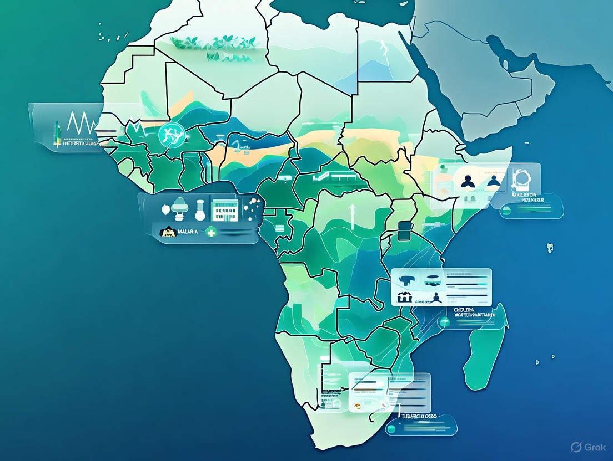
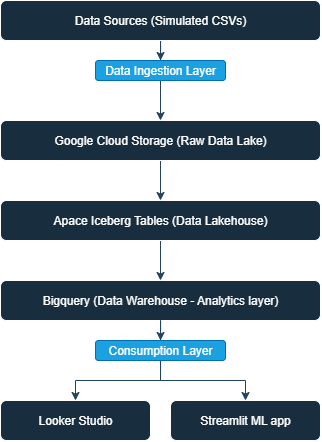

# Infectious Disease Surveillance and Outbreak Prediction

## Project Overview
This project is an end-to-end data project that aims to develop a disease surveillance system. We aim to monitor and predict disease outbreak in Africa.

### Project Objectives
1. Monitor disease trends across regions in real time.
2. Predict potential outbreaks 2-4 weeks in advance.
3. Optimize resource allocation for outbreak response.
4. Reduce response time from outbreak detection to intervension.

### Stakeholders
1. Ministries of Health.
2. Regional/ District health officers.
3. Epidemiologists.
4. Healthcare facility managers.

### Diseases on focus
1. Malaria (seasonal, climate sensitive).
2. Cholera (waterborne, linked to sanitation).
3. Tuberculosis (chronic, treatment adherence tracking).

### Data Sources
We will create synthetic data to simulate the following scenarios:
    1. Disease case reports.
    2. Climate data (rainfall, temperature).
    3. Population demographics.
    4. Helathcare facility information.
    5. Water/sanitation infrastructure.
    6. Geographic boundaries.

## Data Architecture

### 1. Data Lake (Google Cloud Storage)
Storage repository that holds raw data in its native format (CSV, JSON, etc). This is where the simulated disease reports, climate data, facility data will be stored in csv format.

### 2. Data Lakehouse (Apache Iceberg)
A layer that brings database-like features such as ACID transactions to data lake files. Whenever disease data arrives, this layer ensures that exixting data is not corrupted. This ensure we can track changes overtime.
For this project, we will create iceberg tables for:
- `disease_cases` (partitioned by date and region)
- `climate_data` (partitioned by date)
- `facilities` (slowly changing dimension)

### 3. Data Warehouse (BigQuery)
Sql based analytics database optimised for querying large datasets. We will use this for aggregations, complex joins etc.
For this project we will create the following analytical tables:
- `fact_disease_surveillance`
- `dim_facilities`, `dim_geography`, `dim_date`
- Aggregated views for dashboard.