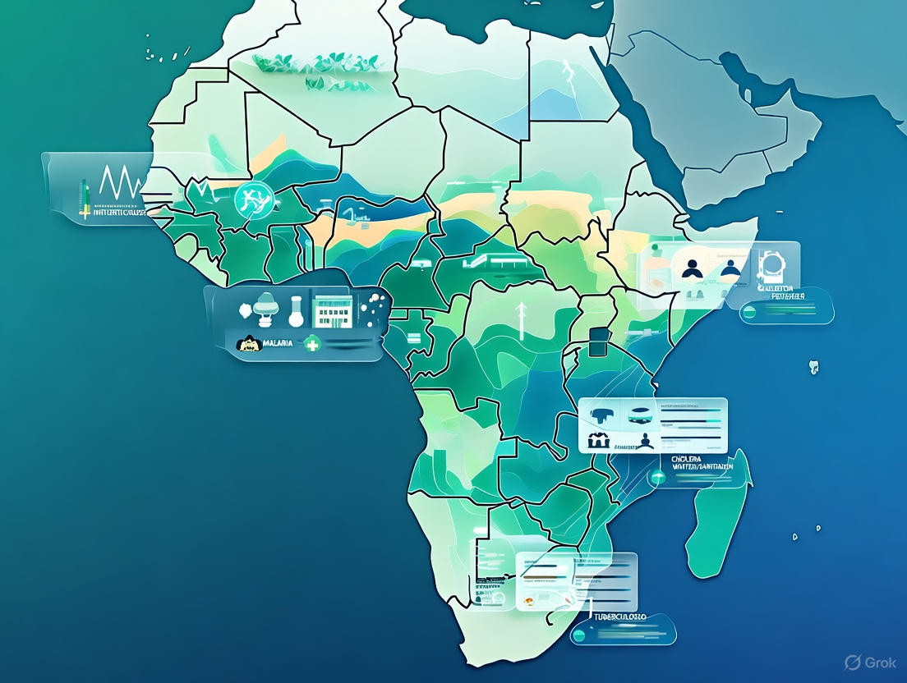
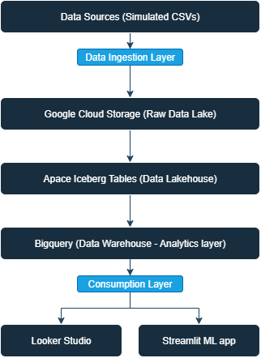

# Infectious Disease Surveillance and Outbreak Prediction

## Project Overview
This project is an end-to-end data project that aims to develop a disease surveillance system. We aim to monitor and predict disease outbreak in Africa.

### Project Objectives
1. Monitor disease trends across regions in real time.
2. Predict potential outbreaks 2-4 weeks in advance.
3. Optimize resource allocation for outbreak response.
4. Reduce response time from outbreak detection to intervension.

### Stakeholders
1. Ministries of Health.
2. Regional/ District health officers.
3. Epidemiologists.
4. Healthcare facility managers.

### Diseases on focus
1. Malaria (seasonal, weather sensitive).
2. Cholera (waterborne, linked to sanitation).
3. Tuberculosis (chronic, treatment adherence tracking).

### Data Sources
We will create synthetic data to simulate the following scenarios:
    1. Disease case reports.
    2. weather data (rainfall, temperature).
    3. Population demographics.
    4. Healthcare facility information.
    5. Geographic boundaries.

### Data Dictionary

#### 1. Geographic data
- Geographical data showing locations.

Column name | Data Type | Description | Example values
------------------|------------|--------------|-------------|
`geography_id` | String | Unique identifier for geographic area | "KE-NAI-001", "ZA-FRE-062", "NG-KAN-028"
`country_code` | String | Country code | "KE", "ZA", "NG"
`country_name` | String | Name of country | "Kenya", "Nigeria", "South Africa"
`region_name` | String | Name of region in the country | "Nairobi", "Kaduna", "Kwazulu-Natal"
`district_name` | String | Name of district | "Nairobi District 1", "Lagos District 2"
`subdistrict_name` | String | Name of sub-district | "Lagos District 2 Sub-district 1"
`population` | Float | Total population count | 10056
`urban_rural` | String | Classification of area type | "Urban", "Rural"
`latitude` | Float | Geographic coordinate | -1.2921, 36.8219
`longitude` | Float | Geographic coordinate | 36.8219, -1.2921
`population_density` | Float | People per square kilometre area  | 912.0

#### 2. Facilities data
- Facilities data showing name, type and facility characteristics such as capacity, staff, and location

Column name | Data Type | Description | Example values
------------------|------------|--------------|-------------|
`facility_id` | String | Unique identifier for facility | "FAC-00001", "FAC-00002"
`geography_id` | String | Foreign key for geographic area | "KE-NAI-001", "ZA-FRE-062", "NG-KAN-028"
`facility_name` | String | Name of facility | "Nairobi District 1 Clinic-1", "Nairobi District 1 Dispensary-2"
`facility_type` | String | Type of facility | "Regional", "Clinic", "Dispensary"
`country_code` | String | Country code | "KE", "ZA", "NG"
`region_name` | String | Name of region in the country | "Nairobi", "Kaduna", "Kwazulu-Natal"
`district_name` | String | Name of district | "Nairobi District 1", "Lagos District 2"
`capacity` | Integer | Total bed count | 100, 527, 400
`staff_count` | Integer | Total staff count | 8, 34, 67
`has_lab` | Boolean | Does the health facility has a lab | Yes/No
`has_isolation_ward` | Boolean | Does the health facility has an isolation ward | Yes/No
`has_xray` | Float | Does the health facility has a functioning xray equipment  | Yes/No
`ambulance_count` | Integer | Number of ambulances | 1, 3
`latitude` | Float | Geographic coordinate | -1.2921, 36.8219
`longitude` | Float | Geographic coordinate | 36.8219, -1.2921
`operational_status` | String | Is the health facility operational | "Operational", "Under construction", "Closed"
`established_year` | Date | Year of establishment | 2009, 1987 

#### 3. Weather data
- Weather conditions recorded in particular dates.

Column name | Data Type | Description | Example values
------------------|------------|--------------|-------------|
`geography_id` | String | Foreign key identifier for geographic area | "KE-NAI-001", "ZA-FRE-062", "NG-KAN-028"
`date` | Date | Date of weather measurement | "2023-01-15", "2023-06-20"	
`temperature_min_c` | Float | Minimum daily temperature in Celsius | 18.5, 22.3
`temperature_max_c` | Float | Minimum daily temperature in Celsius | 30.2, 35.7
`rainfall_mm` | Float | Name of district | "Nairobi District 1", "Lagos District 2"
`humidity_pct` | Float | Humidity percentage | 28, 12

#### 4. Reports data
- This data shows cases reported per day and their outcomes. For example can be that, on 2020-03-12 (case_date), 7(new_cases) male(gender) adults aged 18-49(age_group) got Malaria(disease). Nairobi District 2 Regional Hospital-35(facility) reported the cases on 2020-03-15. Of the cases reported, 5 recovered, 0 died and 3 were reported still in recovery as of date of report.
 
Column name | Data Type | Description | Example values
------------------|------------|--------------|-------------|
`report_id` | String | Unique identifier for each case report | "CASE-0000001", "CASE-0000002"
`report_date` | Date | Date when the case was reported to the surveillance system | "2020-01-15", "2024-06-23"
`case_date` | Date | Date when patient first showed symptoms | "2020-01-15", "2024-06-23"
`facility_id` | String |  Which healthcare facility reported this case | "FAC-0001, "FAC-01256"
`geography_id` | String | Geographic area where case occurred | "KE-NAI-001", "NG-LAG-045"
`disease` | String | Which disease | "Malaria", "Cholera", "Tuberculosis"
`new_cases` | Integer | Number of new cases | 1, 5, 23
`deaths` | Integer | Number of deaths among new cases | 0, 1 , 4
`recoveries` | Integer | Number who recovered | 0, 3, 18
`age_group` | Categorical | Age category of patients | 0-5, 6-17
`gender` | Categorical | Patient gender  | M (Male), F(Female)

## Data Architecture

    

### 1. Data Lake (Google Cloud Storage)
Storage repository that holds raw data in its native format (CSV, JSON, etc). This is where the simulated disease reports, weather data, facility data will be stored in csv format.

### 2. Data Lakehouse (Apache Iceberg)
A layer that brings database-like features such as ACID transactions to data lake files. Whenever disease data arrives, this layer ensures that exixting data is not corrupted. This ensure we can track changes overtime.
For this project, we will create iceberg tables for:
- `disease_cases` (partitioned by date and region)
- `weather_data` (partitioned by date)
- `facilities` (slowly changing dimension)

### 3. Data Warehouse (BigQuery)
Sql based analytics database optimised for querying large datasets. We will use this for aggregations, complex joins etc.
For this project we will create the following analytical tables:
- `fact_disease_surveillance`
- `dim_facilities`, `dim_geography`, `dim_date`
- Aggregated views for dashboard.

###